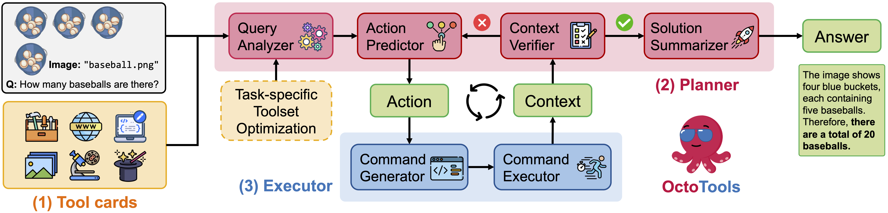
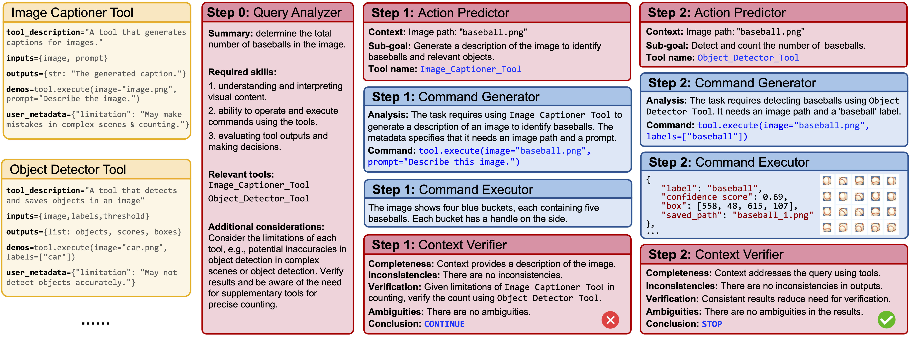
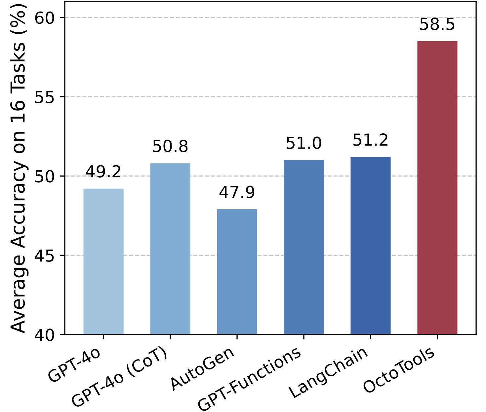
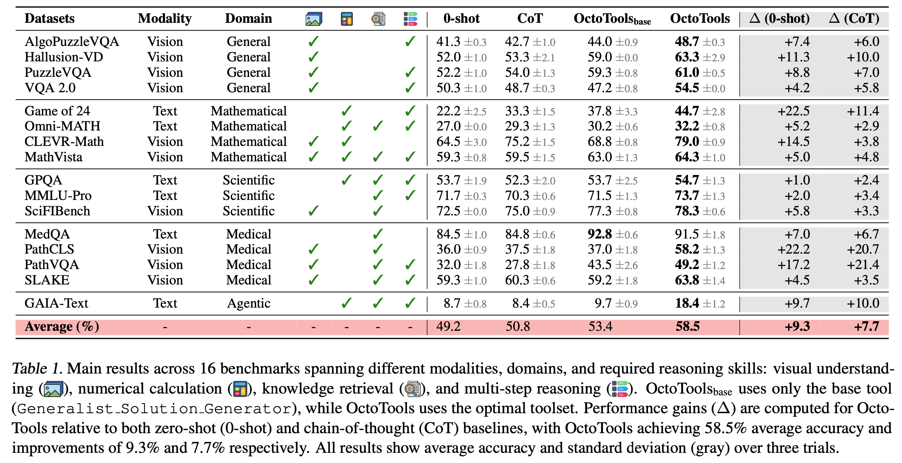
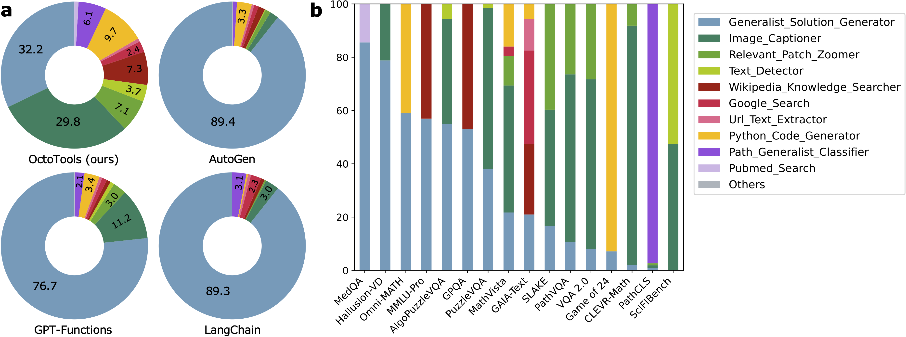
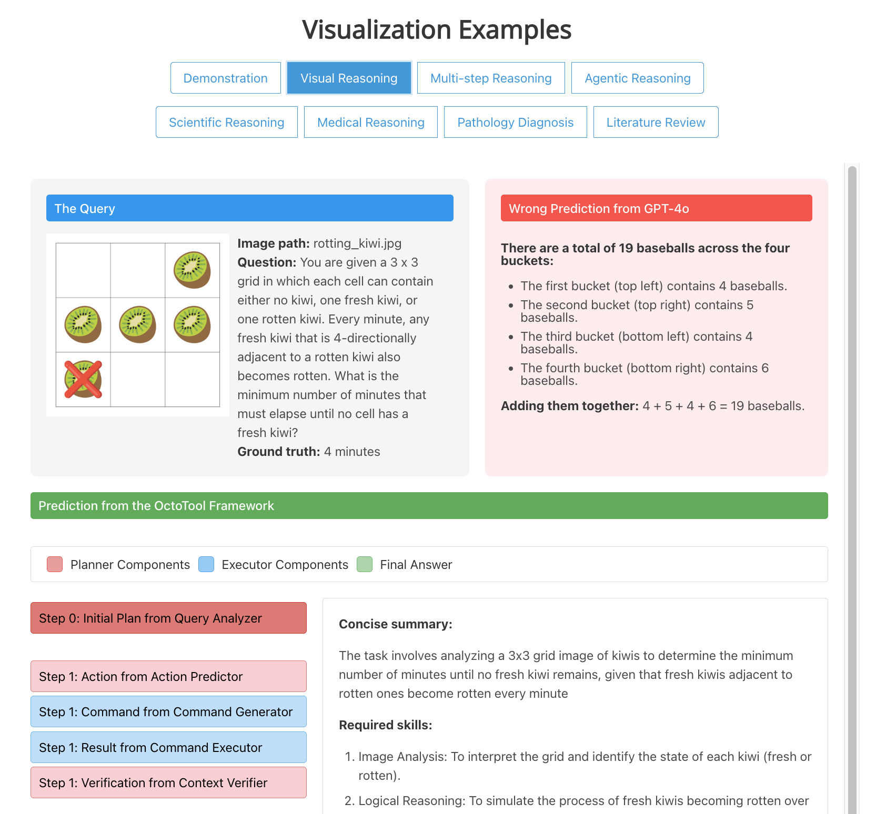
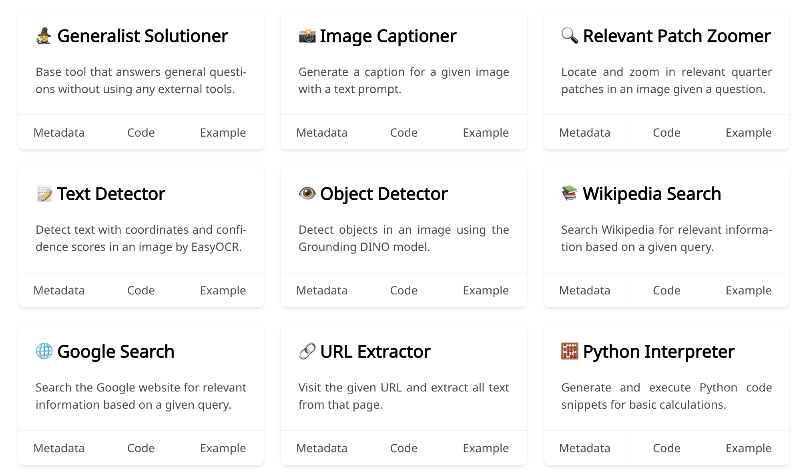

<a name="readme-top"></a>

<div align="center">

</div>

# OctoTools: An Agentic Framework with Extensible Tools for Complex Reasoning

<!-- # <span style="color: #d41544">Octo</span><span style="color: #2176bc">Tools</span>: An Agentic Framework with Extendable Tools for Complex Reasoning -->

<!-- <div align="center">
<h1>
  <span style="display: inline-block;">
    <span style="color: #d41544">Octo</span><span style="color: #2176bc">Tools</span>: An Agentic Framework with Extendable Tools for Complex Reasoning
  </span>
</h1>
</div> -->

<!--- BADGES: START --->
[](https://lbesson.mit-license.org/)
[](https://arxiv.org/abs/2502.11271)
[](https://huggingface.co/spaces/OctoTools/octotools)
[](https://octotools.github.io/#tool-cards)
[](https://octotools.github.io/#visualization)
[](https://x.com/lupantech/status/1892260474320015861)
[](https://discord.gg/NMJx66DC)

<!--- BADGES: END --->

## Introduction

We introduce **OctoTools**, a training-free, user-friendly, and easily extensible open-source agentic framework designed to tackle complex reasoning across diverse domains. **OctoTools** introduces standardized **tool cards** to encapsulate tool functionality, a **planner** for both high-level and low-level planning, and an **executor** to carry out tool usage. 

**Tool cards** define tool-usage metadata and encapsulate heterogeneous tools, enabling training-free integration of new tools without additional training or framework refinement. (2) The **planner** governs both high-level and low-level planning to address the global objective and refine actions step by step. (3) The **executor** instantiates tool calls by generating executable commands and save structured results in the context. The final answer is summarized from the full trajectory in the context. Furthermore, the *task-specific toolset optimization algorithm* learns a beneficial subset of tools for downstream tasks.




We validate **OctoTools**’ generality across 16 diverse tasks (including MathVista, MMLU-Pro, MedQA, and GAIA-Text), achieving substantial average accuracy gains of 9.3% over GPT-4o. Furthermore, **OctoTools** also outperforms AutoGen, GPT-Functions and LangChain by up to 10.6% when given the same set of tools.

<p align="center">  
    
    <!-- Text. -->
</p>

## Installation

Create a conda environment from the `conda.yaml` file:

```sh
conda env create -f conda.yaml
```

Activate the environment and install requirements:

```sh
conda activate octotools
pip install -e .
```

Make `.env` file, and set `OPENAI_API_KEY`, `GOOGLE_API_KEY`, `GOOGLE_CX`, etc. For example:

```sh
# The content of the .env file

# Used for GPT-4o-powered tools
OPENAI_API_KEY=<your-api-key-here>

# Used for the Google Search tool
GOOGLE_API_KEY=<your-api-key-here>
GOOGLE_CX=<your-cx-here>

# Used for the Advanced Object Detector tool (Optional)
DINO_KEY=<your-dino-key-here>
```

Obtain a Google API Key and Google CX according to the [Google Custom Search API](https://developers.google.com/custom-search/v1/overview) documation.

Install `parallel` for running benchmark experiments in parallel:

```sh
sudo apt-get update
sudo apt-get install parallel
```

## Test tools in the toolbox

Using `Python_Code_Generator_Tool` as an example, test the availability of the tool by running the following:

```sh
cd octotools/tools/python_code_generator
python tool.py
```

Expected output:

```
Execution Result: {'printed_output': 'The sum of all the numbers in the list is: 15', 'variables': {'numbers': [1, 2, 3, 4, 5], 'total_sum': 15}}
```

You can also test all tools available in the toolbox by running the following:

```sh
cd octotools/tools
source test_all_tools.sh
```

Expected testing log:

```
Testing advanced_object_detector...
✅ advanced_object_detector passed

Testing arxiv_paper_searcher...
✅ arxiv_paper_searcher passed

...

Testing wikipedia_knowledge_searcher...
✅ wikipedia_knowledge_searcher passed

Done testing all tools
Failed: 0
```

## Run inference on benchmarks

Using [CLEVR-Math](https://huggingface.co/datasets/dali-does/clevr-math) as an example, run inference on a benchmark by:

```sh
cd octotools/tasks

# Run inference from clevr-math using GPT-4 only
source clevr-math/run_gpt4o.sh

# Run inference from clevr-math using the base tool
source clevr-math/run_octotool_base.sh

# Run inference from clevr-math using Octotools with an optimized toolset
source clevr-math/run_octotools.sh
```

More benchmarks are available in the [tasks](https://octotools.github.io/#tasks).


## Experiments


### Main results

To demonstrate the generality of our **OctoTools** framework, we conduct comprehensive evaluations on 16 diverse benchmarks spanning two modalities, five domains, and four reasoning types. These benchmarks encompass a wide range of complex reasoning tasks, including visual understanding, numerical calculation, knowledge retrieval, and multi-step reasoning.


<p align="center">
    
    <!-- Text. -->
</p>


More results are available in the [paper](https://arxiv.org/pdf/2502.11271) or at the [project page](https://octotools.github.io/).


### In-depth analysis

We provide a set of in-depth analyses to help you understand the framework. For instance, we visualize the tool usage of **OctoTools** and its baselines  from 16 tasks. It turns out that **OctoTools** takes advantage of different external tools to address task-specific challenges. Explore more findings at our [paper](https://arxiv.org/pdf/2502.11271) or the [project page](https://octotools.github.io/#analysis).

<a align="center">
    
    <!-- Text. -->
</a>

### Example visualizations

We provide a set of example visualizations to help you understand the framework. Explore them at the [project page](https://octotools.github.io/#visualization).

<p align="center">  
    <a href="https://octotools.github.io/#visualization">
        
    </a>
</p>


## Customize OctoTools

The design of each tool card is modular relative to the **OctoTools** framework, enabling users to integrate diverse tools without modifying the underlying framework or agent logic. New tool cards can be added, replaced, or updated with minimal effort, making **OctoTools** robust and extensible as tasks grow in complexity.

<p align="center">
    <a href="https://octotools.github.io/#tool_cards">
        
    </a>
</p>

To customize **OctoTools** for your own tasks:

1. **Add a new tool card**: Implement your tool following the structure in [existing tools](https://github.com/OctoTools/OctoTools/tree/main/octotools/tools).

2. **Replace or update existing tools**: You can replace or update tools in the toolbox. For example, we provide the [`Object_Detector_Tool`](https://github.com/OctoTools/OctoTools/blob/main/octotools/tools/object_detector/tool.py) to detect objects in images using an open-source model. We also provide an alternative tool called the [`Advanced_Object_Detector_Tool`](https://github.com/OctoTools/OctoTools/blob/main/octotools/tools/advanced_object_detector/tool.py) to detect objects in images using API calls.

3. **Enable tools for your tasks**: You can enable the whole toolset or a subset of tools for your own tasks by setting the `enabled_tools` argument in [tasks/solve.py](https://github.com/OctoTools/OctoTools/blob/main/octotools/tasks/solve.py).


## Resources

### Inspiration

This project draws inspiration from several remarkable projects:

- 📕 [Chameleon](https://github.com/lupantech/chameleon-llm) – Chameleon is an early attempt that augments LLMs with tools, which is a major source of inspiration. A journey of a thousand miles begins with a single step.
- 📘 [TextGrad](https://github.com/mert-y/textgrad) – We admire and appreciate TextGrad for its innovative and elegant framework design.
- 📗 [AutoGen](https://github.com/microsoft/autogen) – A trending project that excels in building agentic systems.
- 📙 [LangChain](https://github.com/langchain-ai/langchain) – A powerful framework for constructing agentic systems, known for its rich functionalities.


### Citation
```bibtex
@article{lu2025octotools,
    title={OctoTools: An Agentic Framework with Extensible Tools for Complex Reasoning},
    author={Lu, Pan and Chen, Bowen and Liu, Sheng and Thapa, Rahul and Boen, Joseph and Zou, James},
    journal = {arXiv preprint arXiv:2502.11271},
    year={2025}
}
```

### Our Team
<table>
	<tbody>
		<tr>
            <td align="center">
                <a href="https://lupantech.github.io/">
                    
                    <br />
                    <sub><b>Pan Lu</b></sub>
                </a>
            </td>
            <td align="center">
                <a href="https://bowen118.github.io/">
                    
                    <br />
                    <sub><b>Bowen Chen</b></sub>
                </a>
            </td>
            <td align="center">
                <a href="https://shengliu66.github.io/">
                    
                    <br />
                    <sub><b>Sheng Liu</b></sub>
                </a>
            </td>
            <td align="center">
                <a href="https://rthapa84.github.io/">
                    
                    <br />
                    <sub><b>Rahul Thapa</b></sub>
                </a>
            </td>
            <td align="center">
                <a href="https://dbds.stanford.edu/people/joseph-boen/">
                    
                    <br />
                    <sub><b>Joseph Boen</b></sub>
                </a>
            </td>
            <td align="center">
                <a href="https://www.james-zou.com/">
                    
                    <br />
                    <sub><b>James Zou</b></sub>
                </a>
            </td>
		</tr>
	<tbody>
</table>


### Contributors

We are trully looking forward to the open-source contributions to OctoTools! If you are interested in contributing, collaborating, or reporting issues, don't hesitate to contact us!

We are also looking forward to your feedback and suggestions!

<p align="right" style="font-size: 14px; color: #2176bc; margin-top: 20px;">
  <a href="#readme-top" style="text-decoration: none; color: blue; font-weight: bold;">
    ↑ Back to Top ↑
  </a>
</p>
